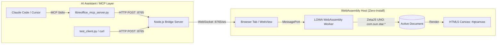

# ZetaJS WebAssembly MCP Bridge Demo

This demo illustrates a **zero-installation, WebAssembly-powered LibreOffice bridge** for `mcp-libre`. It replaces the local desktop LibreOffice installation with **ZetaOffice / LOWA (LibreOffice WebAssembly)** and controls the document model via **ZetaJS** and the native **UNO API (`com.sun.star.*`)**.

---

## 🏛️ Architecture



1. **Node.js Bridge (`server.mjs`)**: Listens on `http://localhost:8765` with Cross-Origin Isolation headers (`COOP`/`COEP`). It exposes the exact REST endpoints expected by `mcp-libre`.
2. **WebAssembly UI (`public/index.html`)**: Connects to the bridge via WebSocket and hosts the interactive ZetaOffice canvas.
3. **UNO Worker Thread (`public/office_thread.js`)**: Runs in the WebAssembly worker. It receives commands and manipulates the document using the real UNO API (`css.text.XTextDocument`, `text.insertString(...)`, `setPropertyValue(...)`).

---

## 🚀 Quick Start

### 1. Install Dependencies
```bash
cd demos/zetajs-mcp-bridge
CI=true pnpm install
```

### 2. Start the Bridge Server
```bash
CI=true pnpm start
# or: node server.mjs
```
The server will start listening on `http://localhost:8765`.

### 3. Open the Document Canvas
Open [http://localhost:8765](http://localhost:8765) in any modern browser (Chrome, Firefox, Edge, Safari).
* The browser will download the ZetaOffice WebAssembly runtime from the official CDN and initialize the UNO ServiceManager.
* You will see the document canvas and a real-time event log.

---

## 🧪 Testing the Bridge

### Option 1: Run the Automated Python Test Client
In another terminal, run:
```bash
python3 demos/zetajs-mcp-bridge/test_client.py
```
This tests:
* `/health`
* `/tools/get_document_info_live`
* `/tools/insert_text_live` (watch the text appear live on your browser canvas!)
* `/tools/format_text_live`
* `/tools/get_text_content_live`

### Option 2: Test with `curl`
```bash
# Check health
curl http://localhost:8765/health

# Insert text via UNO
curl -X POST http://localhost:8765/tools/insert_text_live \
  -H "Content-Type: application/json" \
  -d '{"text": "Hello from curl via ZetaJS UNO!\n"}'

# Read back content
curl -X POST http://localhost:8765/tools/get_text_content_live \
  -H "Content-Type: application/json" \
  -d '{}'
```

### Option 3: Connect AI Assistants via MCP Stdio
The server [`mcp_stdio_server.mjs`](mcp_stdio_server.mjs) exposes the **exact 9 consolidated tools** matching `libreoffice_mcp_server.py`:
1. `document`: create, info, list, content, status, styles, create_style, edit_style, delete_style, style_properties
2. `structure`: outline, paragraph, range, count
3. `cursor`: goto_paragraph, goto_position, position, context
4. `selection`: paragraph, range, delete, replace
5. `search`: find, replace, replace_all
6. `track_changes`: status, enable, disable, list, accept, reject, accept_all, reject_all
7. `comments`: list, add
8. `save`: save, export
9. `text`: insert, format, style

#### A. Claude Code CLI
Add the server directly from the command line:
```bash
claude mcp add libreoffice-wasm -e LIBREOFFICE_URL=http://localhost:8765 -- node $(pwd)/mcp_stdio_server.mjs
```
*(Or use the `/mcp` command inside Claude Code to interactively add the server).*

#### B. Antigravity / Gemini CLI
Add via the `/mcp` slash command in chat or configure in `~/.gemini/config/mcp_config.json`:
```json
{
  "mcpServers": {
    "libreoffice-wasm": {
      "command": "node",
      "args": ["/absolute/path/to/mcp-libre/demos/zetajs-mcp-bridge/mcp_stdio_server.mjs"],
      "env": { "LIBREOFFICE_URL": "http://localhost:8765" }
    }
  }
}
```

#### C. Cursor / Claude Desktop / Other MCP Clients
Add to your client's MCP configuration settings (`cursor_settings.json` or `claude_desktop_config.json`):
```json
{
  "mcpServers": {
    "libreoffice-wasm": {
      "command": "node",
      "args": ["/absolute/path/to/mcp-libre/demos/zetajs-mcp-bridge/mcp_stdio_server.mjs"],
      "env": {
        "LIBREOFFICE_URL": "http://localhost:8765"
      }
    }
  }
}
```

---

## 🔍 How UNO Is Used Internally (`office_thread.js`)

Inside the WebAssembly worker thread, ZetaJS maps the C++ UNO IDL interfaces directly into JavaScript:

```javascript
import { ZetaHelperThread } from './zetajs/zetaHelper.js';

const zHT = new ZetaHelperThread();
const css = zHT.css; // uno.com.sun.star

// 1. Create a document via Desktop service
const xModel = zHT.desktop.loadComponentFromURL('private:factory/swriter', '_default', 0, []);

// 2. Query XTextDocument interface
const doc = css.text.XTextDocument.query(xModel);
const textObj = doc.getText();
const cursor = textObj.createTextCursor();

// 3. Insert text
textObj.insertString(cursor, "Hello via UNO!\n", false);

// 4. Set Character Properties via PropertySet
const props = css.beans.XPropertySet.query(cursor);
const boldAny = new Module.uno_Any(Module.uno_Type.Float(), 150.0);
props.setPropertyValue('CharWeight', boldAny);
boldAny.delete();
```
